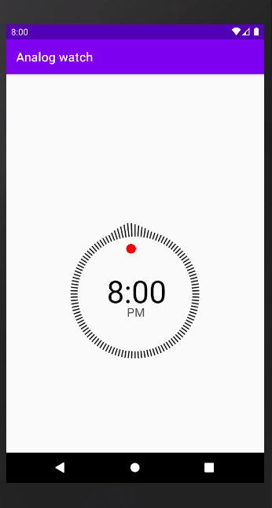

# Analog Watch

[  ](https://bintray.com/luis37/maven/analog_watch/_latestVersion)

An Android custom analog watch. It just works as a decoration.



```kotlin
analogWatch.apply {
    colorShapeCircle = Color.RED
    colorAmPm = Color.DKGRAY
    colorShapeTime = Color.BLACK
    colorTime = Color.BLACK
    is24Hours = false
}
```
